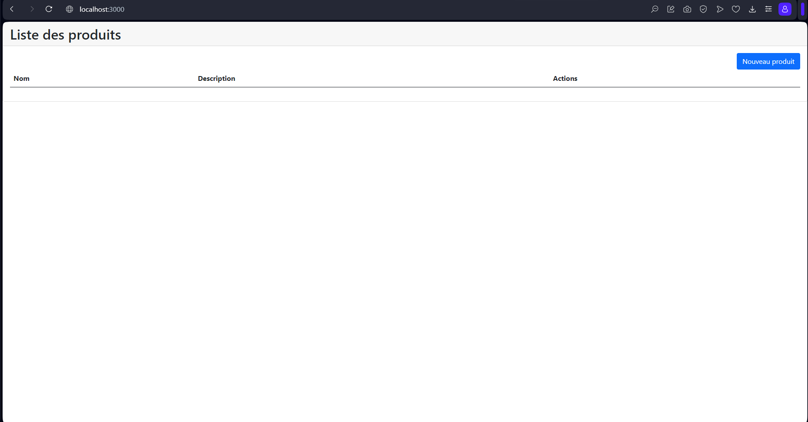

# Docker_DevOps
# Containerization of a React.js, Spring Boot, and MySQL Application with Docker
# LAYOUNE Ghita
## Prerequisites
Make sure you have the following tools installed on your machine::
- Docker
- Docker compose

## Steps

### 1. Project Structure
```
Organize your project as follows: 

├── backend/
│   ├── Dockerfile
│   └── (autres fichiers backend)
├── frontend/
│   ├── Dockerfile
│   └── (autres fichiers frontend)
├── docker-compose.yml
└── README.md

```
### 2. Dockerfile for Frontend (React.js)
Create a Dockerfile in the frontend folder:

frontend/Dockerfile

FROM node:14 AS build

WORKDIR /app

COPY package*.json ./

RUN npm install

COPY . .

RUN npm run build

FROM nginx:alpine

COPY --from=build /app/build /usr/share/nginx/html

EXPOSE 80

CMD ["nginx", "-g", "daemon off;"]


### 3. Dockerfile for Backend (Spring Boot)
Create a Dockerfile in the backend folder:

backend/Dockerfile

FROM openjdk:8-alpine
ADD target/*.jar app.jar
ENTRYPOINT ["java","-jar","app.jar"]


### 4. Docker Compose Configuration
Create a docker-compose.yml file at the root of the project:

docker-compose.yml

version: "3"
services: 
  springboot-app:
   # container_name: spring-app
    image: springbooot-app
    restart: always
    build: ./backend
    ports:
      - 8080:8080 
    environment:
      MYSQL_HOST: mysqldb
      MYSQL_USER: root
      MYSQL_PASSWORD: root
      MYSQL_PORT: 3306
  mysqldb: 
    container_name: mysqldb
    image: mysql
    ports: 
     - 3307:3306   
    environment:
      MYSQL_DATABASE: test
      MYSQL_ROOT_PASSWORD: root

  react-frontend:
    container_name: react-frontend
    image: frontend
    build: ./frontend
    ports:
      - 3000:80


### 5. Build and Run Containers

Run the command docker-compose up

Enter the following URL in your browser: http://localhost:3000/



